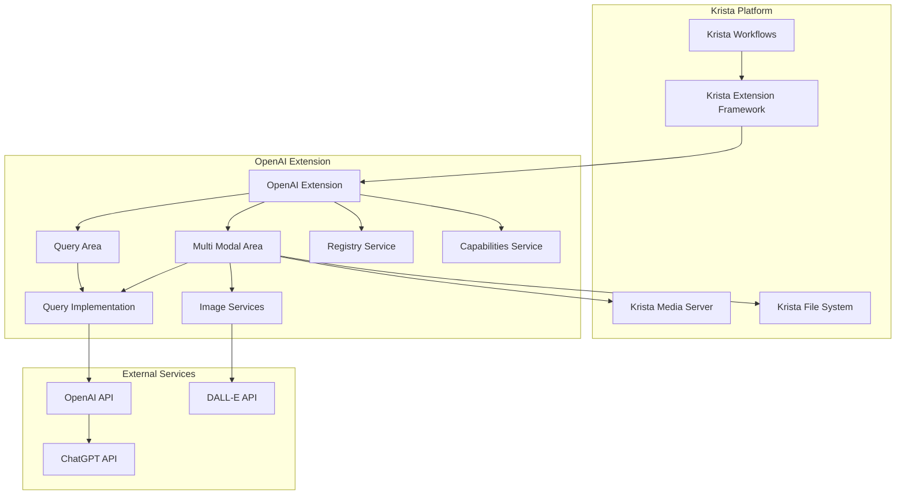
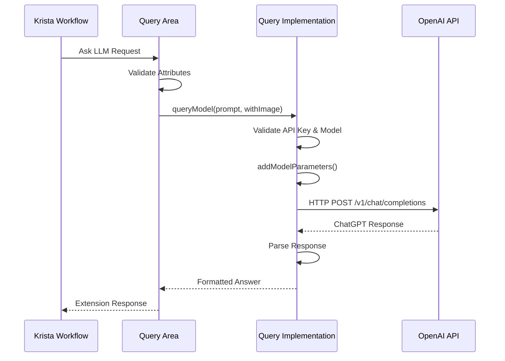
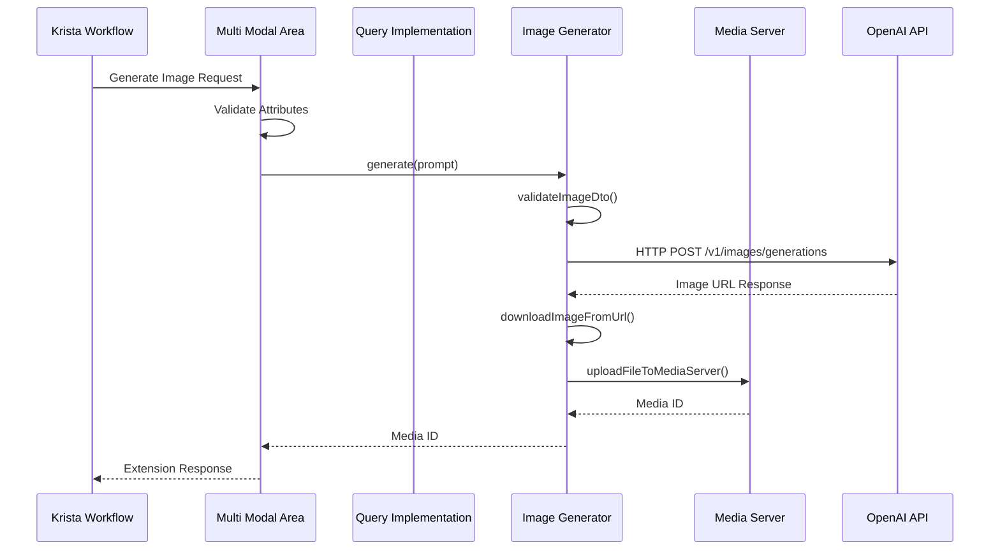
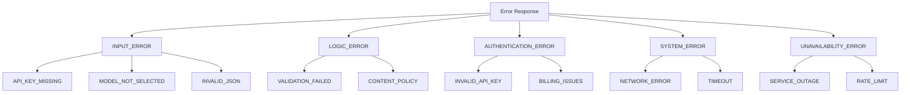
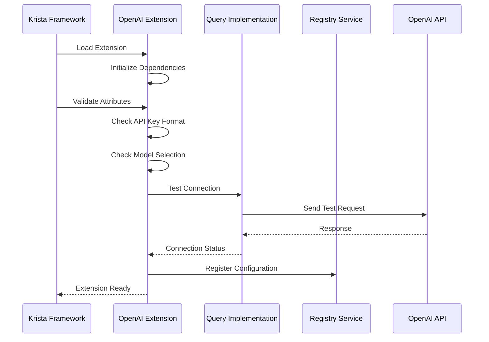
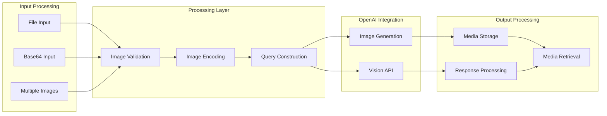
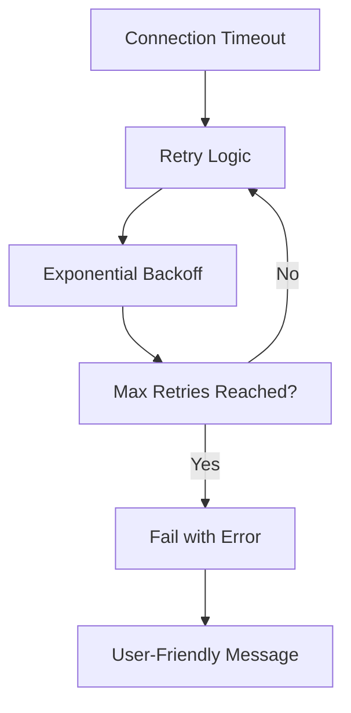
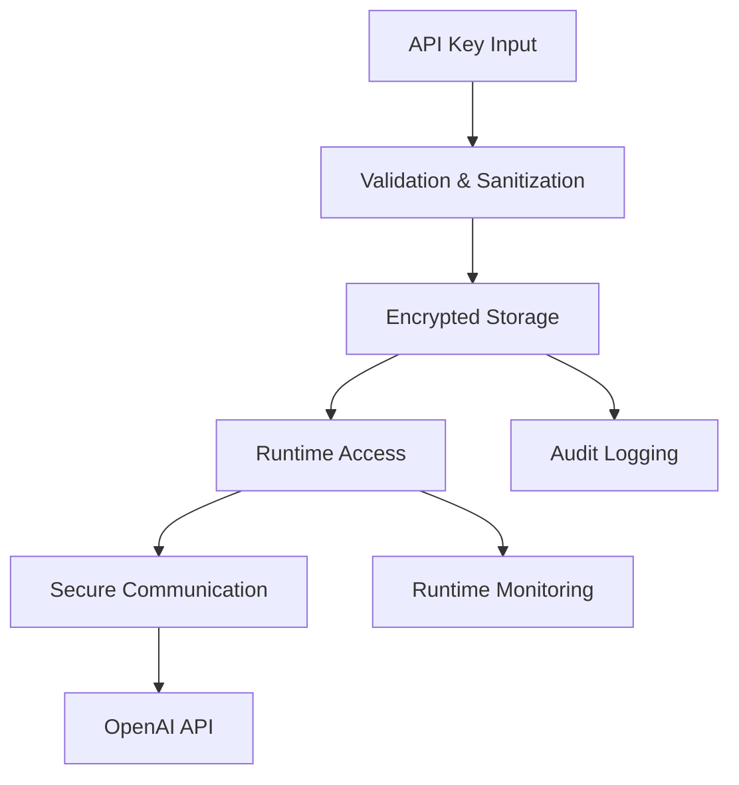

# OpenAI Extension Architecture

## Overview

The OpenAI Extension is a comprehensive integration layer that enables Krista workflows to interact with OpenAI's services including ChatGPT models and DALL-E image generation. This document provides a detailed analysis of the extension's architecture, performance characteristics, and operational considerations.

## System Architecture

### High-Level Architecture



### Layered Architecture

The extension follows a layered architecture pattern with clear separation of concerns:

## Layer 1: Extension Framework Integration

### OpenAI Extension (Main Entry Point)
- **Package**: `app.krista.extensions.krista.llms.openai_qa`
- **Class**: `OpenAIExtension.java`
- **Responsibilities**:
  - Extension lifecycle management
  - Configuration validation
  - Connection testing
  - Dependency injection coordination
  - Custom tab registration

### Key Annotations and Configuration
```java
@Extension(version = "2.1.3-rc1", jaxrsId = "openai")
@Field.Text(value = "API Key", isSecured = true)
@Field.PickOne(value = "Model Name", values = {...})
@StaticResource(path = "docs", file = "docs")
```

## Layer 2: Catalog Request Handlers

### Query Area
- **Package**: `app.krista.extensions.krista.llms.openai_qa.catalog`
- **Class**: `QueryArea.java`
- **Domain**: LLMs
- **Catalog Requests**:
  - Ask LLM (Structured prompting)
  - Ask a Question (Simple queries)
  - Get AI Model Name
  - Get LLM Capabilities

### Multi Modal Area
- **Package**: `app.krista.extensions.krista.llms.openai_qa.catalog`
- **Class**: `MultiModalArea.java`
- **Domain**: LLMs
- **Catalog Requests**:
  - Summarize Image
  - Answer Question from Image
  - Answer Question from Base64 Image
  - Answer Question from Multiple Base64 Images
  - Generate Image

## Layer 3: Business Logic Implementation

### Query Implementation
- **Package**: `app.krista.extensions.krista.llms.openai_qa.impl`
- **Class**: `QueryImpl.java`
- **Responsibilities**:
  - OpenAI API communication
  - Request/response transformation
  - Error handling and retry logic
  - Performance monitoring
  - Token management

### Image Generation
- **Package**: `app.krista.extensions.krista.llms.openai_qa.catalog`
- **Class**: `ImageGenerator.java`
- **Responsibilities**:
  - DALL-E API integration
  - Image validation
  - Media server integration
  - File handling

## Layer 4: Service Layer

### Registry Service
- **Package**: `app.krista.extensions.krista.llms.openai_qa.service`
- **Class**: `RegistryService.java`
- **Responsibilities**:
  - Connection management
  - Configuration propagation
  - Service discovery

### Capabilities Service
- **Package**: `app.krista.extensions.krista.llms.openai_qa.service`
- **Class**: `CapabilitiesService.java`
- **Responsibilities**:
  - Feature capability reporting
  - Model capability mapping

## Layer 5: Data Transfer Objects

### Request/Response Models
- `ChatGPTResponse.java` - OpenAI API response structure
- `ImageDtoIn.java` - Image generation request
- `ImageMetaData.java` - Image metadata
- `ImageGenerationResponse.java` - Image generation response

## Data Flow Architecture

### Text Query Processing Flow



### Image Processing Flow



## Performance Characteristics

### Connection Management

#### HTTP Client Configuration
```java
OkHttpClient.Builder builder = new OkHttpClient.Builder()
    .connectTimeout(10, TimeUnit.SECONDS)
    .readTimeout(60, TimeUnit.SECONDS);
```

#### Image Generation Timeouts
```java
HttpClient client = HttpClient.newBuilder()
    .connectTimeout(Duration.ofSeconds(10))
    .build();
```

### Performance Limitations

#### Request Timeouts
- **Connection Timeout**: 10 seconds
- **Read Timeout**: 60 seconds
- **Image Generation**: 10 seconds connection timeout

#### Token Limitations
- **Balanced Input/Output**: 4,096 tokens
- **Maximum Response Tokens**: 2,048 tokens
- **GPT-4 Latest**: Up to 16,000 response tokens

#### Rate Limiting
- **OpenAI API Limits**: Varies by subscription tier
- **Retry Mechanism**: Built-in with exponential backoff
- **Failsafe Library**: Used for rate limit handling

### Model Performance Characteristics

| Model | Speed | Quality | Use Case | Token Limit |
|-------|-------|---------|----------|-------------|
| ChatGPT 3.5 | Fast | Good | General queries | 16K |
| ChatGPT 4 | Moderate | Excellent | Complex analysis | 8K |
| ChatGPT 4 Latest | Moderate | Excellent | Latest features | 128K |
| ChatGPT 4.1 Mini | Fast | Very Good | Balanced performance | 128K |

## Error Handling Architecture

### Error Classification



### Error Scenarios and Handling

#### Configuration Errors
- **API Key Missing**: User-friendly guidance with setup links
- **Model Not Selected**: Clear model selection instructions
- **Connection Test Failed**: Comprehensive troubleshooting steps

#### Runtime Errors
- **Rate Limiting**: Automatic retry with exponential backoff
- **Service Unavailable**: Graceful degradation with user guidance
- **Network Timeouts**: Retry mechanism with circuit breaker pattern

#### Validation Errors
- **Image Parameters**: Specific validation for size, quality, count
- **JSON Format**: Structured error messages for malformed requests
- **Content Policy**: Clear guidance on policy compliance

## Security Architecture

### API Key Management
- **Secured Storage**: API keys marked as `isSecured = true`
- **Injection Pattern**: Dependency injection for secure access
- **Validation**: Runtime validation of API key format and validity

### Request Security
- **HTTPS Only**: All external communications use HTTPS
- **Bearer Token**: Standard OAuth 2.0 Bearer token authentication
- **Input Sanitization**: Validation of all user inputs

## Scalability Considerations

### Connection Pooling
- **Singleton HTTP Client**: Shared OkHttpClient instance
- **Connection Reuse**: HTTP/1.1 keep-alive connections
- **Thread Safety**: Synchronized client initialization

### Resource Management
- **Memory Optimization**: Streaming for large image processing
- **File Cleanup**: Temporary file management
- **Connection Limits**: Configurable connection pool sizes

### Horizontal Scaling
- **Stateless Design**: No session state maintained
- **Load Distribution**: Multiple extension instances supported
- **Registry Service**: Service discovery and configuration propagation

## Monitoring and Observability

### Performance Metrics
- **Execution Time**: Logged for all API calls
- **Response Monitoring**: Success/failure tracking
- **Error Classification**: Detailed error categorization

### Logging Strategy
- **Structured Logging**: SLF4J with configurable levels
- **Request Tracing**: Full request/response logging
- **Performance Tracking**: Execution time measurements

## Integration Patterns

### Dependency Injection
```java
@Inject
@Named(OpenAIConstants.API_KEY)
private InvokerAttributeProvider<String> apiKey;
```

### Service Registration
```java
@Service
public class QueryImpl { ... }
```

### Extension Lifecycle
```java
@InvokerRequest(InvokerRequest.Type.VALIDATE_ATTRIBUTES)
@InvokerRequest(InvokerRequest.Type.TEST_CONNECTION)
@InvokerRequest(InvokerRequest.Type.INVOKER_UPDATED)
```

## Deployment Architecture

### Extension Packaging
- **JAR Distribution**: Self-contained extension JAR
- **Documentation**: Embedded static resources
- **Dependencies**: Managed through Gradle build system

### Runtime Environment
- **Java 21**: Required runtime version
- **Krista Platform**: Extension framework integration
- **External Dependencies**: OpenAI API, media services

## Component Interaction Diagrams

### Extension Initialization Flow



### Multi-Modal Processing Architecture



## Performance Analysis

### Throughput Characteristics

#### Text Processing Performance
- **Simple Queries**: 1-3 seconds average response time
- **Complex Prompts**: 3-10 seconds depending on model
- **Structured JSON**: Additional 100-200ms for parsing

#### Image Processing Performance
- **Image Analysis**: 5-15 seconds for vision models
- **Image Generation**: 10-30 seconds for DALL-E
- **Base64 Encoding**: 50-200ms for typical images
- **Media Server Upload**: 200-500ms depending on size

### Memory Usage Patterns

#### Baseline Memory
- **Extension Overhead**: ~50MB base memory
- **HTTP Client Pool**: ~10MB connection pool
- **Service Instances**: ~5MB for all services

#### Request Processing Memory
- **Text Requests**: 1-5MB per concurrent request
- **Image Processing**: 10-50MB per image (depending on size)
- **Base64 Operations**: 2x image size in memory temporarily

### Bottleneck Analysis

#### Primary Bottlenecks
1. **OpenAI API Latency**: 1-30 seconds depending on request complexity
2. **Network Bandwidth**: Image upload/download operations
3. **Rate Limiting**: OpenAI subscription tier limitations
4. **Memory**: Large image processing operations

#### Mitigation Strategies
1. **Connection Pooling**: Reuse HTTP connections
2. **Async Processing**: Non-blocking I/O operations
3. **Retry Logic**: Exponential backoff for rate limits
4. **Resource Management**: Proper cleanup of temporary resources

## Error Scenarios and Recovery

### Network-Related Errors

#### Connection Timeouts


#### DNS Resolution Failures
- **Symptoms**: Unable to resolve api.openai.com
- **Recovery**: Fallback to IP addresses, network diagnostics
- **User Impact**: Connection test failures, request timeouts

### API-Related Errors

#### Rate Limiting (429 Status)
- **Detection**: HTTP 429 response code
- **Recovery**: Exponential backoff retry (1s, 2s, 4s, 8s)
- **User Impact**: Delayed responses, temporary service degradation

#### Authentication Errors (401 Status)
- **Detection**: HTTP 401 response code
- **Recovery**: API key validation, user notification
- **User Impact**: All requests fail until key is corrected

#### Service Unavailable (503 Status)
- **Detection**: HTTP 503 response code
- **Recovery**: Retry with longer delays, service status check
- **User Impact**: Temporary service interruption

### Application-Level Errors

#### Memory Exhaustion
- **Symptoms**: OutOfMemoryError during large image processing
- **Recovery**: Graceful degradation, resource cleanup
- **Prevention**: Image size validation, streaming processing

#### Configuration Errors
- **Symptoms**: Invalid model selection, malformed API keys
- **Recovery**: Configuration validation, user guidance
- **Prevention**: Input validation, format checking

## Security Considerations

### Data Protection

#### API Key Security


#### Data in Transit
- **Encryption**: TLS 1.2+ for all external communications
- **Certificate Validation**: Full certificate chain validation
- **Header Security**: Secure header handling for authentication

#### Data at Rest
- **API Keys**: Encrypted storage in Krista platform
- **Temporary Files**: Secure cleanup after processing
- **Logs**: Sanitized logging without sensitive data

### Input Validation

#### Request Sanitization
- **JSON Validation**: Schema validation for structured inputs
- **Image Validation**: File type, size, and format validation
- **Content Filtering**: Basic content policy compliance

#### Injection Prevention
- **SQL Injection**: N/A (no direct database access)
- **Command Injection**: Input sanitization for file operations
- **XSS Prevention**: Output encoding for web responses

## Operational Considerations

### Monitoring Requirements

#### Health Checks
- **Extension Status**: Regular health check endpoints
- **API Connectivity**: Periodic connection testing
- **Service Dependencies**: Registry and capabilities service monitoring

#### Performance Metrics
- **Response Times**: P50, P95, P99 latency tracking
- **Error Rates**: Success/failure ratio monitoring
- **Throughput**: Requests per minute/hour tracking

#### Alerting Thresholds
- **High Error Rate**: >5% failure rate over 5 minutes
- **Slow Response**: >30 seconds average response time
- **Connection Failures**: >3 consecutive connection failures

### Maintenance Procedures

#### Regular Maintenance
- **Log Rotation**: Daily log file rotation and cleanup
- **Connection Pool**: Weekly connection pool refresh
- **Cache Cleanup**: Temporary file cleanup every 6 hours

#### Emergency Procedures
- **Service Restart**: Graceful shutdown and restart procedures
- **Configuration Rollback**: Ability to revert to previous configuration
- **Circuit Breaker**: Automatic service isolation during failures

### Capacity Planning

#### Scaling Metrics
- **Concurrent Users**: Maximum supported concurrent requests
- **Request Volume**: Peak requests per hour capacity
- **Resource Utilization**: CPU, memory, and network usage patterns

#### Growth Projections
- **Linear Scaling**: Performance scales linearly with request volume
- **Resource Requirements**: Memory scales with image processing volume
- **Network Bandwidth**: Scales with image generation frequency

This comprehensive architecture provides a robust foundation for enterprise-scale OpenAI integration while maintaining security, performance, and operational excellence.
