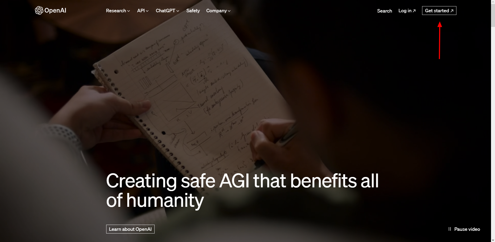
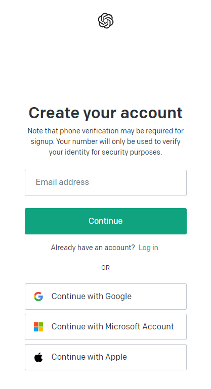
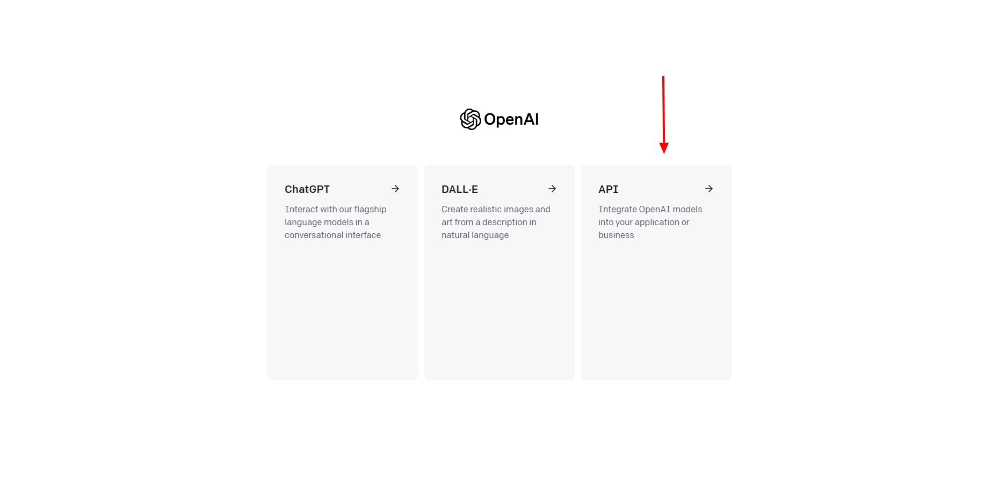
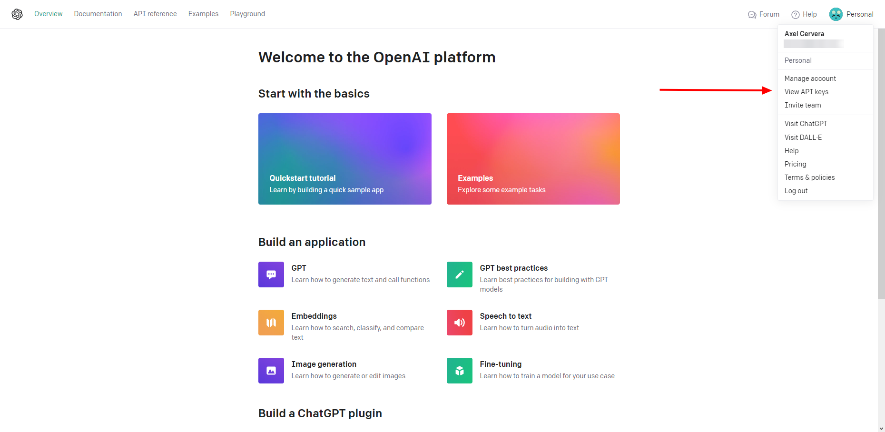
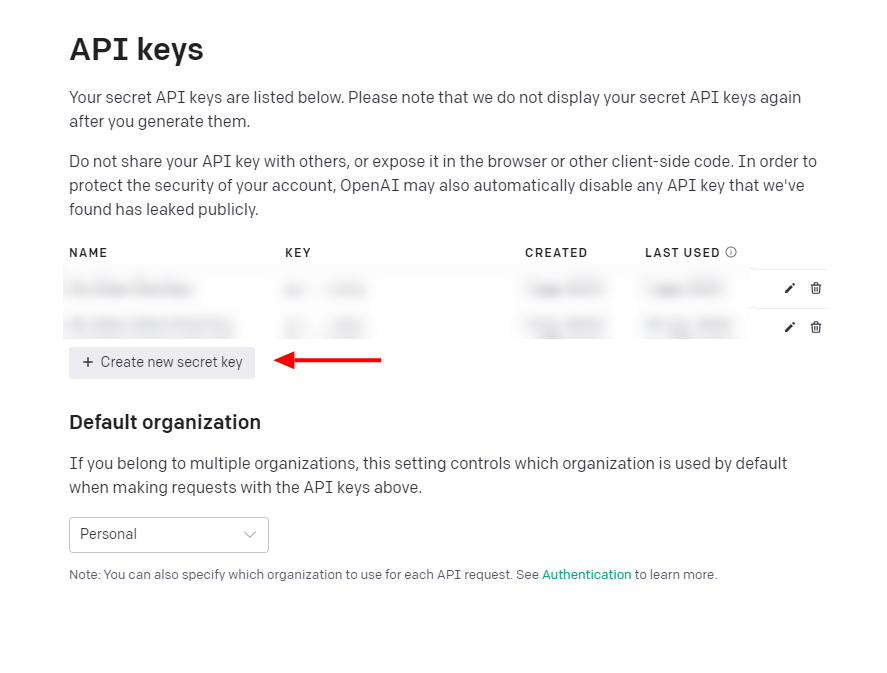
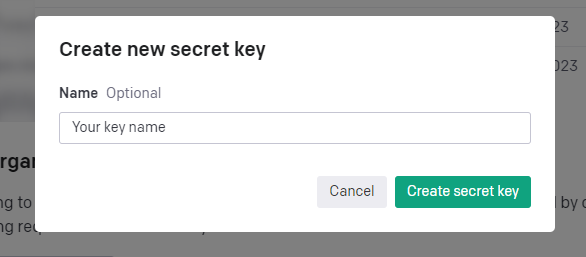
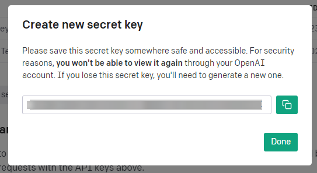
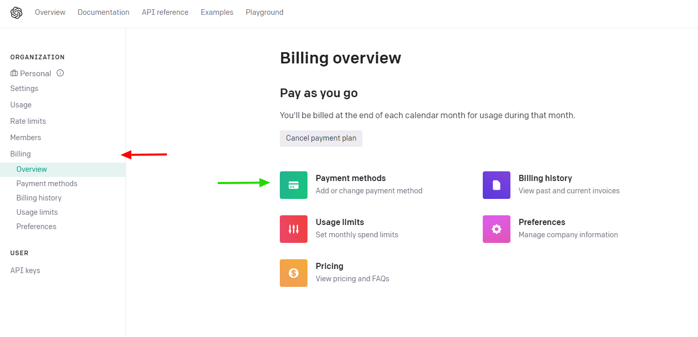

# Creating OpenAI App

## Overview

To use the OpenAI Extension with Krista, you need to create an OpenAI account and generate an API key. This guide walks you through the complete process of setting up your OpenAI account, creating API keys, and configuring billing for advanced features.

## Prerequisites

- A valid email address for account creation
- Credit card for billing setup (required for most API usage)
- Internet access to OpenAI's platform

## Step-by-Step Instructions

### Step 1: Create OpenAI Account

1. **Visit OpenAI Website**
   - Navigate to [https://openai.com](https://openai.com)
   - Click on **Get Started** button



2. **Choose Authentication Method**
   - A login/sign up page will appear
   - Select your preferred authentication method:
     - Email and password
     - Google account
     - Microsoft account
     - Apple ID



3. **Complete Account Setup**
   - Follow the prompts to verify your email
   - Complete any required profile information
   - Accept OpenAI's terms of service

### Step 2: Access API Platform

1. **Navigate to API Section**
   - After logging in, you'll see options to get started
   - Select **API Integration** for programmatic access



2. **Access API Dashboard**
   - The OpenAI API dashboard will load
   - This is where you'll manage your API keys and usage

### Step 3: Create API Key

1. **Access API Keys Section**
   - Click on your profile picture in the top-right corner
   - Select **View API Keys** from the dropdown menu



2. **Create New API Key**
   - In the API Keys page, click **Create new secret key**
   - This will open the key creation dialog



3. **Name Your API Key**
   - Enter a descriptive name for your API key (optional but recommended)
   - Use names like "Krista-Production" or "Krista-Development"
   - Click **Create** to generate the key



4. **Save Your API Key**
   - **⚠️ IMPORTANT**: Copy and save your API key immediately
   - The key will only be shown once and cannot be retrieved later
   - Store it securely - you'll need it for Krista configuration



> **🔒 Security Warning**: Never share your API key publicly or include it in code repositories. Treat it like a password.

### Step 4: Set Up Billing (Required)

1. **Access Billing Section**
   - Navigate to the **Billing** section in the left sidebar
   - Billing setup is required for most API usage beyond free tier



2. **Add Payment Method**
   - Click **Add payment method**
   - Enter your credit card information
   - Set up usage limits to control costs

3. **Configure Usage Limits**
   - Set monthly spending limits
   - Configure usage alerts
   - Review pricing for different models

## Verification

### Test Your API Key

Before configuring the Krista extension, verify your API key works:

1. **Using curl** (optional):
```bash
curl https://api.openai.com/v1/models \
  -H "Authorization: Bearer YOUR_API_KEY"
```

2. **Using OpenAI Playground**:
   - Visit the OpenAI Playground
   - Test a simple prompt
   - Verify responses are generated

### Check Account Status

Ensure your account is properly configured:

- ✅ Email verified
- ✅ API key created and saved
- ✅ Billing method added
- ✅ Usage limits configured
- ✅ API access confirmed

## Model Access and Billing

### Free Tier Limitations
- Limited monthly usage
- Access to basic models only
- Rate limiting applies

### Paid Tier Benefits
- Access to all models (GPT-3.5, GPT-4, DALL-E)
- Higher rate limits
- Priority access during high demand
- Advanced features

### Model Pricing (as of current date)
Pricing varies by model - check OpenAI's pricing page for current rates:
- **GPT-3.5 Turbo**: Most cost-effective
- **GPT-4**: Higher cost, better performance
- **GPT-4 Turbo**: Optimized for efficiency
- **DALL-E**: Image generation pricing

## Security Best Practices

### API Key Management
1. **Use Project Keys**: Create project-specific keys when possible
2. **Rotate Regularly**: Change keys periodically
3. **Monitor Usage**: Check usage dashboard regularly
4. **Set Alerts**: Configure spending and usage alerts

### Access Control
1. **Limit Permissions**: Use least-privilege principle
2. **Environment Separation**: Different keys for dev/prod
3. **Team Management**: Control team member access

## Troubleshooting

### Common Setup Issues

#### Account Verification Problems
**Issue**: Email verification not received
**Solution**: 
- Check spam folder
- Ensure email address is correct
- Request new verification email

#### Billing Setup Failures
**Issue**: Payment method rejected
**Solution**:
- Verify card information
- Check with your bank
- Try alternative payment method
- Contact OpenAI support

#### API Key Generation Errors
**Issue**: Cannot create API key
**Solution**:
- Complete account verification
- Set up billing first
- Check account status
- Contact OpenAI support

### Getting Help

- **OpenAI Help Center**: [https://help.openai.com](https://help.openai.com)
- **API Documentation**: [https://platform.openai.com/docs](https://platform.openai.com/docs)
- **Community Forum**: OpenAI Community
- **Support**: Contact OpenAI support for account issues

## Next Steps

After completing your OpenAI setup:

1. **Configure Krista Extension**: Use your API key in [Extension Configuration](pages/ExtensionConfiguration.md)
2. **Test Connection**: Validate your setup works with Krista
3. **Review Authentication**: Understand [Authentication](pages/Authentication.md) details
4. **Start Building**: Begin using AI capabilities in your workflows

## See Also

- [Extension Configuration](pages/ExtensionConfiguration.md) - Configure the extension with your API key
- [Authentication](pages/Authentication.md) - Understand OpenAI authentication
- [Ask a Question](pages/AskAQuestion.md) - Test your setup with a simple query
