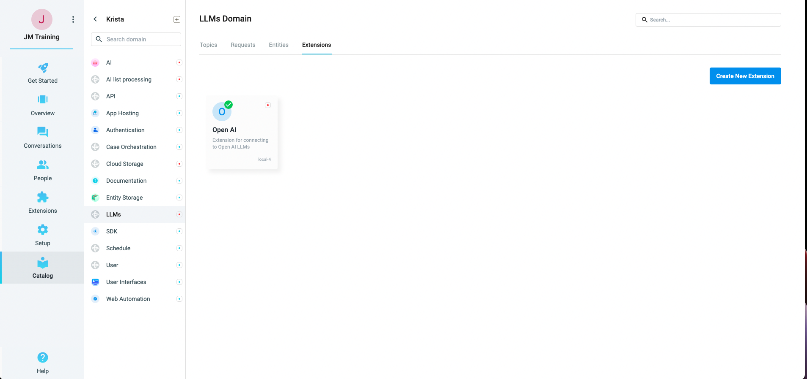
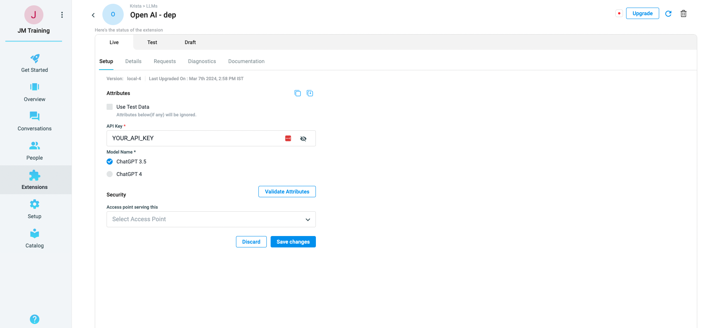
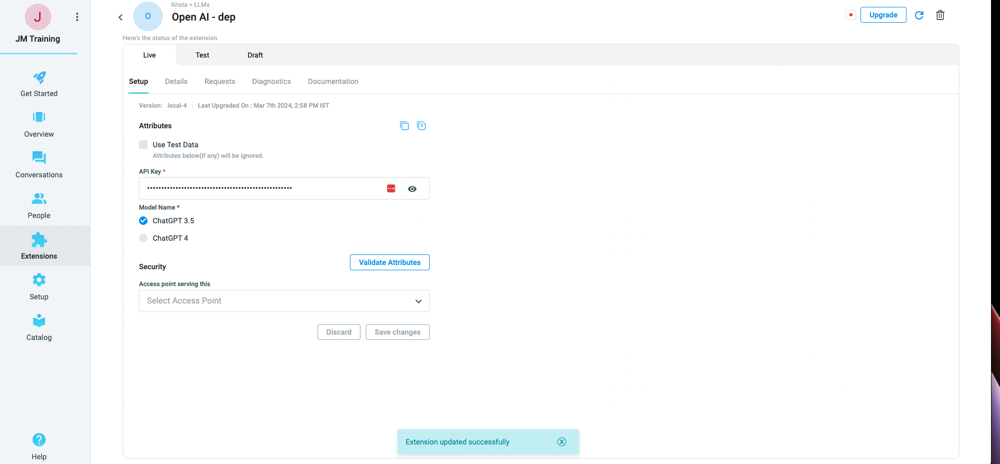

# How to configure the OpenAI extension

#### Step 1
Select the OpenAI Extension Which is present in Catalog -> Krista -> LLMs -> Extensions -> OpenAI

#### Step 2
Add the extension to workspace and enter API Key created in the [setup](pages/CreatingOpenAIApp.md) and the OpenAI REST API URL (https://api.openai.com/) in the proper fields:

#### Step 3
Finally, validate the attributes by clicking on the *validate attributes* button:

After clicking on Yes, a toast should appear with a successful message on it:

